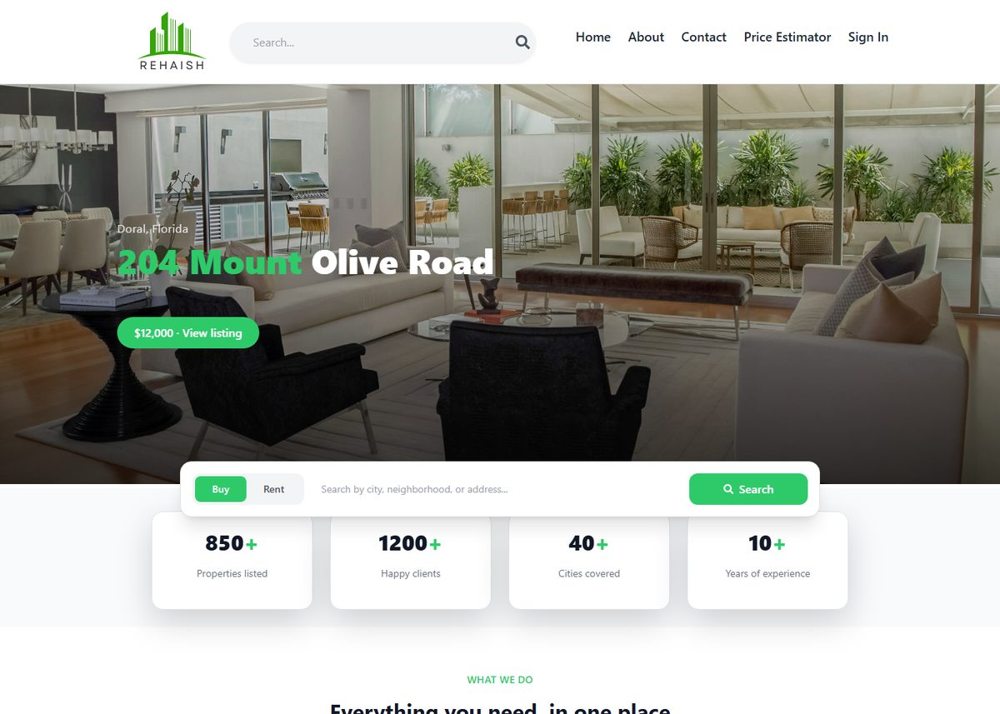
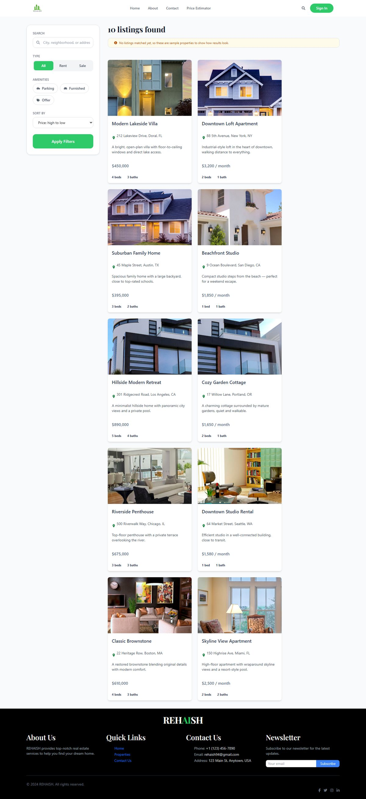
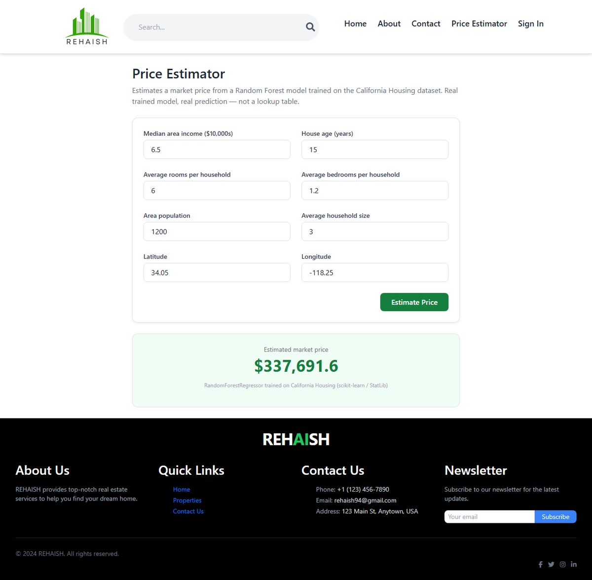
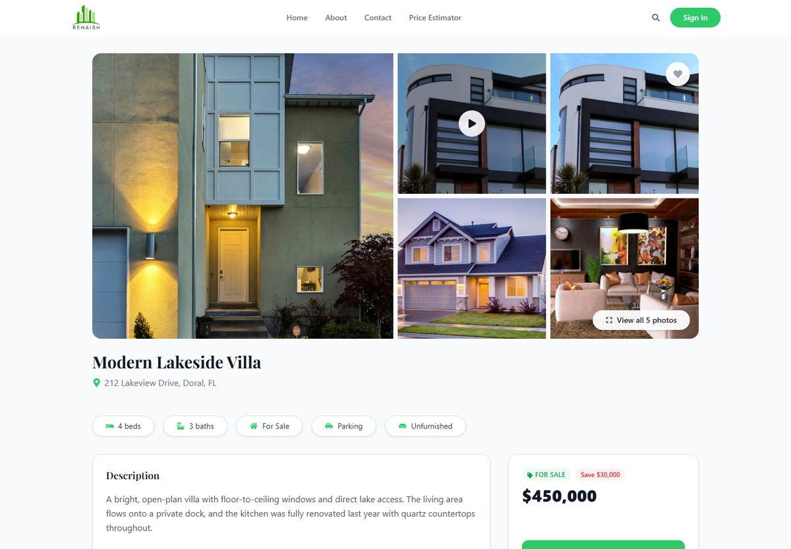
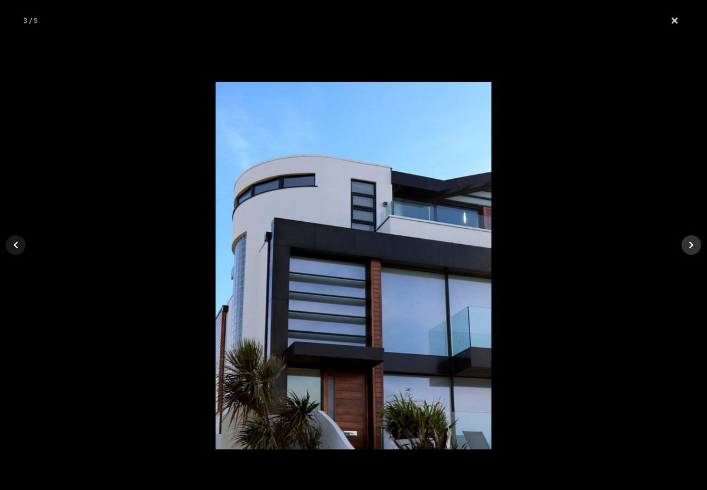
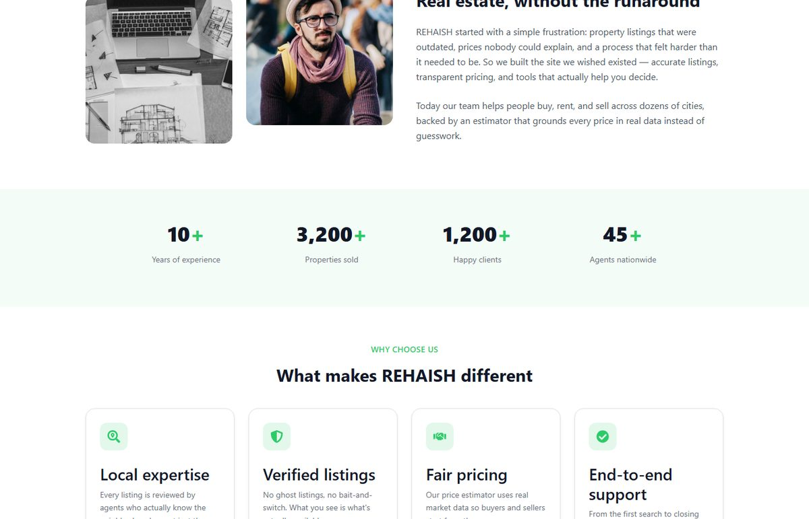

# REHAISH

A full-stack real estate platform (MERN) with a real machine-learning price estimator built in — not a template, not a UI-only demo. Search, list, and manage properties, get an ML-backed price estimate before you buy or sell, and browse listings through a gallery experience with real photo tours.

**Live demo:** https://rehaish-six.vercel.app/



## What's actually in here

- **Full MERN stack** — Express + MongoDB API, JWT auth with email verification, React 18 + Vite frontend.
- **A real trained ML model**, not a mock. `ml-price-estimator/` trains a Random Forest regressor on the California Housing dataset (R² ≈ 0.79, MAE ≈ $34k), serves it via FastAPI, and wires it into a **Price Estimator** page with instant, genuine predictions.
- **A listing detail page built like a real estate SaaS product** — an Airbnb-style photo grid, a fullscreen lightbox that never crops your photos, and real property tour video (not a mock — trimmed/compressed from licensed Pexels footage).
- **A search experience with honest fallbacks** — if the database is empty, the app tells you it's showing sample listings instead of silently faking results.
- **Scroll-based reveal animations, a minimal design system, and a consistent brand** across every page — Home, Search, Listing, About, Contact, Sign in/up.



## Price Estimator



Pick a location, adjust a few sliders, and get an instant price estimate — powered by a Random Forest model trained and evaluated in a real notebook (`ml-price-estimator/notebooks/train.ipynb`), not a hardcoded number. Full write-up, EDA, and metrics are in [`ml-price-estimator/README.md`](ml-price-estimator/README.md).

## Listing gallery & photo tours




Every photo is shown uncropped in the fullscreen lightbox. Two sample listings include a real property tour video alongside the photos.

## About page



## Tech Stack

**Frontend:** React 18, Vite, React Router, Redux Toolkit + redux-persist, Tailwind CSS, Swiper, react-slick
**Backend:** Node.js, Express, MongoDB (Mongoose), JSON Web Tokens, Nodemailer
**ML service:** Python, scikit-learn, FastAPI (see [`ml-price-estimator/`](ml-price-estimator/))

## Getting Started

### 1. Clone and install

```bash
git clone https://github.com/SyedHamza-Dev/Real-Estate-MERNStack.git
cd Real-Estate-MERNStack
npm install          # backend deps (root package.json)
cd client && npm install && cd ..
```

### 2. Set up environment variables

The backend needs a `.env` file at `api/.env`. Copy the example and fill it in:

```bash
cp api/.env.example api/.env
```

You'll need:

| Variable | What it's for | Where to get it |
|---|---|---|
| `MONGODB_URI` | Database connection | Free cluster at [MongoDB Atlas](https://www.mongodb.com/cloud/atlas/register) |
| `JWT_SECRET` | Signs login tokens | Any long random string — `node -e "console.log(require('crypto').randomBytes(32).toString('hex'))"` |
| `EMAIL_HOST` / `EMAIL_PORT` | SMTP server | `smtp.gmail.com` / `587` works for Gmail |
| `EMAIL_USER` / `EMAIL_PASS` | SMTP login | A Gmail address + an [App Password](https://myaccount.google.com/apppasswords) (needs 2FA enabled on the account) |

**How email verification works:** when someone signs up, the backend generates a 6-character code, emails it via the SMTP credentials above, and the account stays unverified until that code is entered on the `/verify-email` page. Without a working `EMAIL_*` config, accounts still get created in MongoDB, but the verification email won't send — so sign-in will keep failing with "Please verify your email first."

### 3. Run it

```bash
# terminal 1 — backend (from the repo root)
npm run dev

# terminal 2 — frontend
cd client && npm run dev
```

Open [http://localhost:5173](http://localhost:5173).

> Without a `.env` set up, the frontend still works — Search and the Home page fall back to clearly-labeled sample listings, and the Price Estimator doesn't need the Node backend at all (see below). Sign in/up and creating real listings do need the MongoDB + email config above.

### Price Estimator service (optional, separate from the Node backend)

```bash
cd ml-price-estimator/service
python -m venv venv && venv\Scripts\activate   # or source venv/bin/activate on macOS/Linux
pip install -r requirements.txt
uvicorn main:app --port 8500
```

Full details in [`ml-price-estimator/README.md`](ml-price-estimator/README.md).

## Project Structure

```
Real-Estate-MERNStack/
├── api/                     # Express backend
│   ├── controllers/         # auth, listing, user, admin, contact
│   ├── models/               # Mongoose schemas
│   ├── routes/
│   └── .env.example
├── client/                  # React frontend (Vite)
│   └── src/
│       ├── pages/            # Home, Search, Listing, About, Contact, PriceEstimator, ...
│       ├── components/
│       └── data/sampleListings.js   # honest fallback data, not fake API responses
└── ml-price-estimator/       # real trained model + FastAPI service
    ├── notebooks/train.ipynb
    ├── model/
    └── service/main.py
```

## Author

**Syed Hamza Ali** — [GitHub](https://github.com/SyedHamza-Dev)
