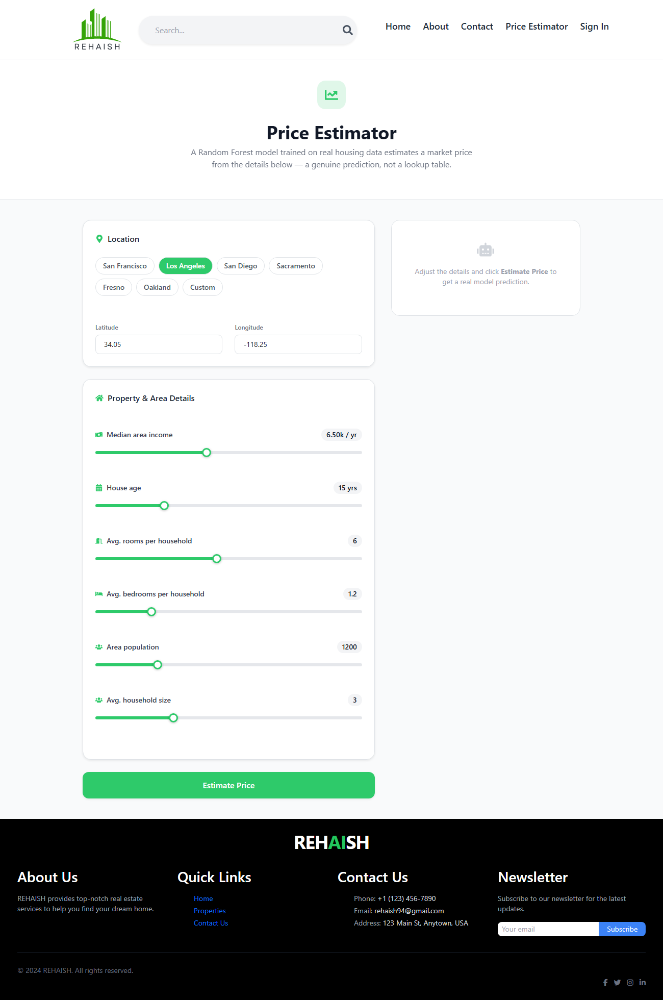
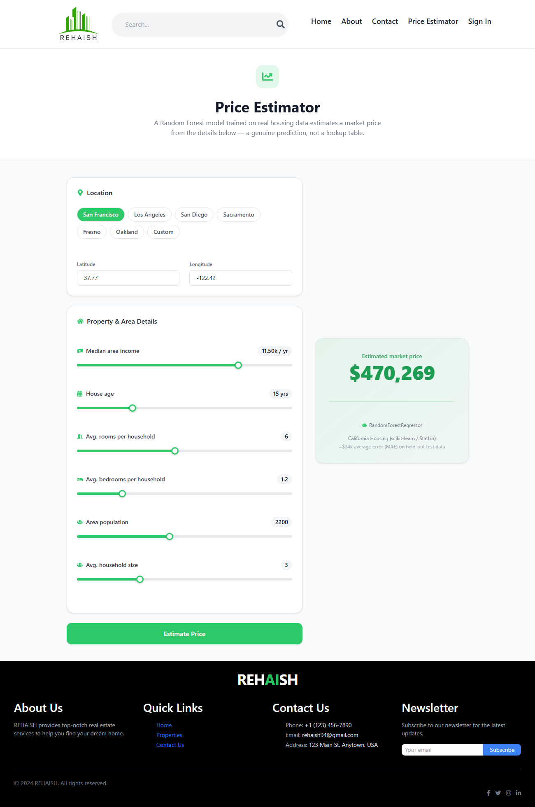

# Price Estimator — ML add-on for Rehaish

A real, trained regression model that estimates a market price from
property/location features, wired into the Rehaish frontend as a
**Price Estimator** page. Not a lookup table or hardcoded number —
the prediction comes from a Random Forest model trained and evaluated
in a notebook, served over a small API.





## Why this dataset

Rehaish's own listings don't have enough volume/history to train a
meaningful price model, so this uses the **California Housing**
dataset (20,640 records, scikit-learn/StatLib) — the standard
regression benchmark dataset, chosen so the model is trained on real,
well-understood data rather than synthetic or fabricated numbers. The
Price Estimator page asks for the same kind of features this dataset
uses (income level, rooms, location, etc.) rather than pretending to
price arbitrary Rehaish listings directly.

## Pipeline

```
ml-price-estimator/
├── notebooks/
│   ├── train.py         # source of truth (jupytext-paired script)
│   └── train.ipynb      # executed notebook — EDA, training, evaluation
├── model/
│   ├── price_model.joblib     # trained RandomForestRegressor
│   ├── feature_order.joblib   # exact feature order the model expects
│   └── eda_*.png               # EDA plots generated by the notebook
└── service/
    ├── main.py           # FastAPI app serving POST /predict
    └── requirements.txt
```

1. **EDA** (`train.ipynb`) — target distribution, feature correlation
   heatmap, and a geographic scatter of price vs. lat/long.
2. **Baseline** — Linear Regression (R² ≈ 0.58) to sanity-check that a
   non-trivial model is actually needed.
3. **Model** — RandomForestRegressor (100 trees, max depth 12),
   **R² ≈ 0.79, MAE ≈ $34k, RMSE ≈ $52k** on a held-out 20% test split.
4. **Serving** — the trained model is loaded once at API startup and
   served via a `/predict` endpoint (FastAPI).
5. **Frontend** — `client/src/pages/PriceEstimator.jsx` posts the form
   values to the API and renders the real returned estimate.

## Running it locally

**1. Train (optional — a trained model is already committed):**

```bash
cd ml-price-estimator/notebooks
pip install -r ../service/requirements.txt jupyter matplotlib seaborn jupytext
jupyter nbconvert --to notebook --execute --inplace train.ipynb
```

**2. Serve:**

```bash
cd ml-price-estimator/service
pip install -r requirements.txt
uvicorn main:app --port 8500
```

**3. Frontend:** the `PriceEstimator` page reads the API URL from
`VITE_PRICE_API_URL` (defaults to `http://localhost:8500`). Run the
existing `client` dev server as usual — the new page is at
`/price-estimator`, linked from the header nav. It includes preset
buttons for a few California cities (auto-fills income/population/
lat-long) and sliders for the rest, styled to match Rehaish's existing
green branding.

## Author

**Syed Hamza Ali** — [GitHub](https://github.com/SyedHamza-Dev)
